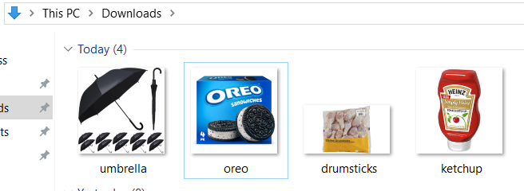

# stock-project

Stock Project, a basic web service implementing REST API, is built with Spring Boot framework of version 3.<br>
I am going to explain briefly about the following details.
- Setting
- Features
- Testing

# 1. Setting
One of the choices to start a Spring Boot is to enter https://start.spring.io/ and select the following<br>
(1) packages/libraries manager: Maven or Gradle<br>
(2) Language<br>
(3) JDK version<br>
(4) Project Metadata: <b>Group</b> represents company's name, <b>Artifact</b> represents your project's name.
(4) dependencies (also know as libraries if you are working with other languages)

Alternatively, developers can generate the project structure locally on their machine rather than utilizing Spring Initialzr's web interface.

It is worth paying attention to choosing <b>dependencies</b>. I choose <b>`Spring Web`</b> and <b>`Lombok`</b> for this project.<br>
The Spring Web dependency serves as a container that come with what I need to build a web service and REST API, especially built-in web server like Apache Tomcat.<br>
Note that there is another way of 
The installation process downloads all dependencies, resulting in the following folder structure, which is the standard folder structure of Maven.

'<br>
'---src<br>
'&nbsp;&nbsp;&nbsp;&nbsp;&nbsp;'---main<br>
'&nbsp;&nbsp;&nbsp;&nbsp;&nbsp;'&nbsp;&nbsp;&nbsp;&nbsp;'---java<br>
'&nbsp;&nbsp;&nbsp;&nbsp;&nbsp;'&nbsp;&nbsp;&nbsp;&nbsp;'&nbsp;&nbsp;&nbsp;&nbsp;'---Main.java<br>
'&nbsp;&nbsp;&nbsp;&nbsp;&nbsp;'&nbsp;&nbsp;&nbsp;&nbsp;'<br>
'&nbsp;&nbsp;&nbsp;&nbsp;&nbsp;'&nbsp;&nbsp;&nbsp;&nbsp;'---resources<br>
'&nbsp;&nbsp;&nbsp;&nbsp;&nbsp;'&nbsp;&nbsp;&nbsp;&nbsp;'&nbsp;&nbsp;&nbsp;&nbsp;'---static<br>
'&nbsp;&nbsp;&nbsp;&nbsp;&nbsp;'&nbsp;&nbsp;&nbsp;&nbsp;'&nbsp;&nbsp;&nbsp;&nbsp;'---template<br>
'&nbsp;&nbsp;&nbsp;&nbsp;&nbsp;'&nbsp;&nbsp;&nbsp;&nbsp;<br>
'&nbsp;&nbsp;&nbsp;&nbsp;&nbsp;'---test<br>
'&nbsp;&nbsp;&nbsp;&nbsp;&nbsp;&nbsp;&nbsp;&nbsp;&nbsp;'---java<br>
'&nbsp;&nbsp;&nbsp;&nbsp;&nbsp;&nbsp;&nbsp;&nbsp;&nbsp;'&nbsp;&nbsp;&nbsp;&nbsp;'---Test.java<br>
'&nbsp;&nbsp;&nbsp;&nbsp;&nbsp;&nbsp;&nbsp;&nbsp;&nbsp;<br>
'&nbsp;&nbsp;&nbsp;&nbsp;&nbsp;&nbsp;&nbsp;&nbsp;&nbsp;<br>
'---pom.xml<br>
'---.mvn<br>
'---mvnw.cmd<br><br>
mvnw.cmd and '

`mvnw.cmd` and `.wvn` are Maven file, with which I do not need to install Maven by myself. Maven is neccessary for building a project.<br>
`pom.xml` is the collection of package configuration in XML format.<br>
For example, spring-boot-starter-web will be defined, which contains built-in Apache Tomcat in it.
```
<dependency>  
    <groupId>org.springframework.boot</groupId>  
    <artifactId>spring-boot-starter-web</artifactId>  
</dependency>  
```
<br>
# 2. Features



# 3. Tesing


